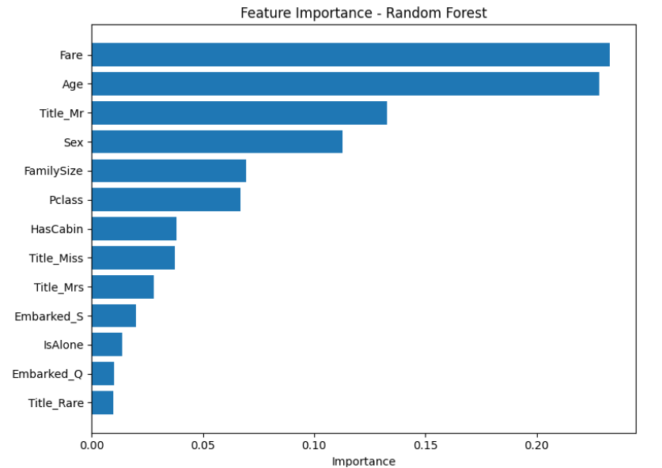
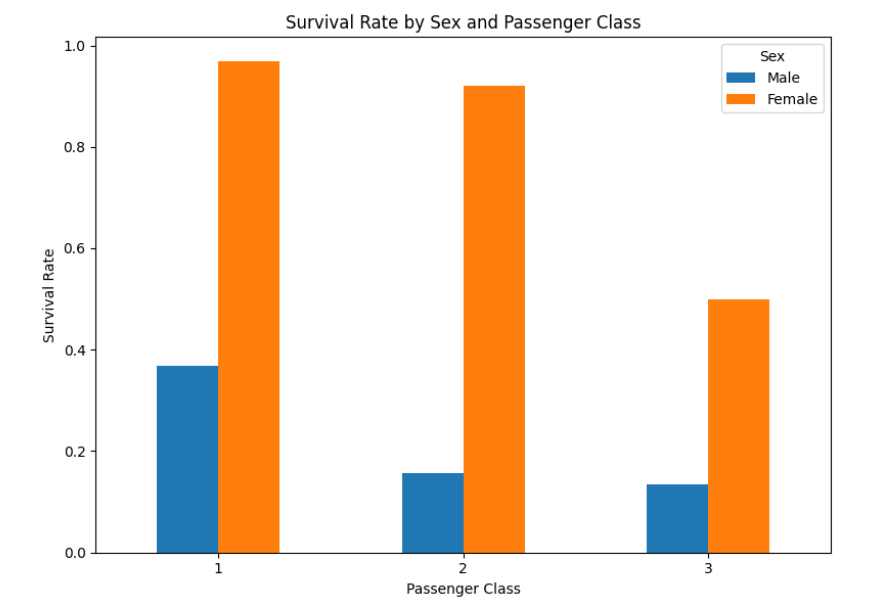

# 🚢 Titanic Survival Prediction

A machine learning project based on Kaggle's **Titanic: Machine Learning from Disaster** competition. The objective is to predict whether a passenger survived the Titanic disaster using demographic and travel-related information.

This project compares **Logistic Regression** and **Random Forest** models and demonstrates the impact of feature engineering on predictive performance.

---
## ⭐ Project Highlights

- Compared Logistic Regression and Random Forest classifiers
- Achieved **84.92% accuracy** using Random Forest
- Performed feature engineering (Title, FamilySize, IsAlone, HasCabin)
- Built a complete end-to-end machine learning pipeline
  
## 📖 Overview

The workflow includes:

- Data cleaning
- Missing value handling
- Feature engineering
- Exploratory analysis
- Model training
- Model comparison
- Performance evaluation

---

## 📊 Dataset

## Dataset

##The dataset can be downloaded from Kaggle's Titanic competition.
---

## 🛠 Tech Stack

- Python
- Pandas
- NumPy
- Matplotlib
- Scikit-learn
- Jupyter Notebook

---

## 🧹 Data Preprocessing

The following preprocessing steps were performed:

- Filled missing Embarked values using the mode
- Filled missing Age values using the median age for each passenger title (computed from training data only)
- Converted Cabin into a binary HasCabin feature
- Encoded Sex as binary values
- One-hot encoded Embarked and Title
- Removed unnecessary columns:
  - PassengerId
  - Name
  - Ticket
  - Cabin
  - SibSp
  - Parch

---

## ⚙️ Feature Engineering

The following features were created:

- HasCabin
- FamilySize
- IsAlone
- Passenger Title extracted from Name

Final features used:

- Pclass
- Sex
- Age
- Fare
- HasCabin
- FamilySize
- IsAlone
- Embarked_Q
- Embarked_S
- Title_Miss
- Title_Mr
- Title_Mrs
- Title_Rare

---

## 🤖 Models Used

### Logistic Regression

Accuracy: **82.12%**

| Metric | Score |
|--------|------:|
| Precision | 0.82 |
| Recall | 0.82 |
| F1 Score | 0.82 |

---

### Random Forest

Configuration:

```python
RandomForestClassifier(
    n_estimators=100,
    random_state=42
)
```

Accuracy: **84.92%**

| Metric | Score |
|--------|------:|
| Precision | 0.85 |
| Recall | 0.85 |
| F1 Score | 0.85 |

✅ Random Forest achieved the best overall performance.

---

## 📈 Results

| Model | Accuracy |
|--------|----------|
| Logistic Regression | 82.12% |
| Random Forest | **84.92%** |

Random Forest outperformed Logistic Regression by approximately **2.8 percentage points**.

---

## 📷 Visualizations

### Feature Importance



---

### Survival Rate by Sex and Passenger Class



---

## 🚀 How to Run

Clone the repository:

```bash
git clone https://github.com/bhavyammisra/titanic-survival-prediction.git
```

Install dependencies:

```bash
pip install -r requirements.txt
```

Launch Jupyter Notebook:

```bash
jupyter lab
```

Open:

```
notebook/Titanic_Survival_Prediction.ipynb
```

---

## 📚 Key Learnings

Through this project I learned:

- Data preprocessing
- Feature engineering
- Handling missing values
- Encoding categorical variables
- Training multiple ML models
- Model evaluation using Accuracy, Precision, Recall and F1-score
- Comparing machine learning algorithms

---

## 🔮 Future Improvements

- Hyperparameter tuning using GridSearchCV
- Cross-validation
- Confusion Matrix
- ROC Curve
- Feature selection
- XGBoost
- LightGBM

---

## 📜 License

This project is intended for educational purposes.
